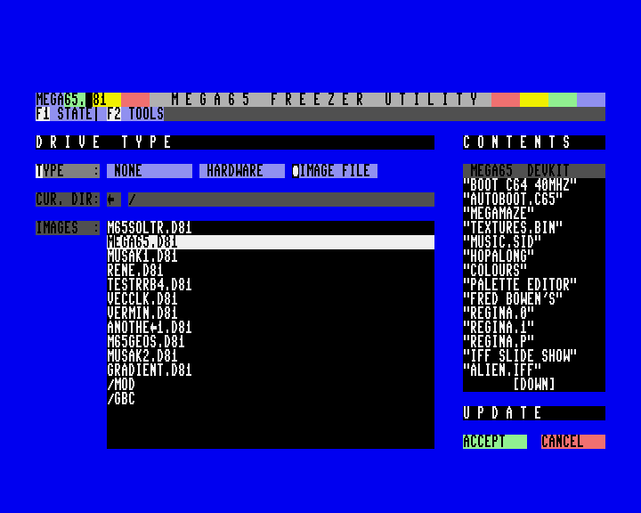

# MEGA65 Freezer Utility
(c) Copyright 2022, Daniel England, Paul Gardner-Stephen, M.E.G.A..  All Rights Reserved.

## Introduction
Welcome to the M65 Freezer version 2 readme!  

The M65 Freezer application is designed to be used as the MEGA65 Freezer utility.  The utility is launched from the SD Card when the machine is "frozen" (a-la the "freezer carts").

This is a new version of the Freezer application now using the Karl Jr. and Jude libraries for its interface.

## License
The M65 Freezer, Karl Jr. and Jude modules are released under the terms of the LGPL.

## Requirements
A bitstream with the recent keyboard matrix fixes is required to run this program.

## Layout
The application functionality is divided into "pages".  There is a page for managing the machine state, a page for launching tools and another for managing disk drives.  There are also "bars" for important information.  A "view" contains a number of these bars and pages.  Only one page can be visible (or active) at a time.  Furthermore, a page is divided into "panels".  Each panel can contain controls and so too can the menu bars.

The first two pages are accessed via the buttons on the menu bar.  The third is accessed by configuring a drive.

For this application, there are two (2) bars at the top of the screen (title and menu bars) and a page shown in the remainder of the screen.

## Controls
Use the cursor keys and tab key to navigate controls or simply point with the mouse.  Most controls don't don't become "active" until they are interacted with or navigated to but some may do so just by pointing. 

Clicking a control or pressing return while it is active will make it go "down".  Most controls will return to the "up" state immediately after processing the intended behaviour in their event handler.  Button type controls, for example, exhibit this behaviour.  However, Edit controls, for example, will stay "down", allowing the user to enter data until the user presses return at which point, the control will go back "up" and editing will end.  This scheme has been chosen to best suit the control methods available to the system.  Namely, joystick, mouse, keyboard and touch can all function equally well.

Some controls may be disabled until certain conditions are met.  Other controls cannot be navigated to and simply provide a mechanism for other actions such as keyboard accelerators, discussed below, or static text.

Controls will display these states by use of colour.  Different colours are used depending upon whether the control is enabled, active, picked (pointed to with the mouse) or down as well as to give a general indication of the type (button/text/static etc).

Some controls have keyboard "accelerators" associated with them.  These will be displayed on the control as a highlighted character (or characters).  When used, the accelerators will cause the associated control to go down and become active.  Some controls (such as labels) activate and down other controls than themselves, instead.  This is to provide convenient access to controls that would otherwise not be able to have an accelerator.  To use the accelerator, simply press and hold the MEGA key in combination with the character displayed.  Some keys are also always considered to be accelerators, even without the MEGA key.  These are special keys such as the Function Keys and ESC.

There are also standard accelerators, MEGA + Return is an accelerator for Accept and ESC for Cancel, as examples.

Some controls can be "checked".  When this is the case, a solid marker will appear to the left of the control's text.  Most often, these controls will be in what is called a "Radio Button Group".  This groups together mutually exclusive options or settings.  Only one of the controls in the group can be checked.  When a control in the group becomes checked, the others are unchecked automatically.  To make a control checked, simply click on when picked or press return when active, to down the control.

## Pages

### State Page

Here is a screen shot of the State page.  The page is divided into the Task, Drives, Keys, CPU and Features panels.

The Task panel displays general information about the program that was running as well as a thumbnail image of the screen at the point at which is was "frozen".

The Drives panel allows you to manipulate the currently mounted disk images as well as the type of the drive and unit # associated with it.  For more information, see the Drive page.

The Keys panel lists hot keys for common tasks.

On the CPU panel, you can change the speed and mode of the CPU.

From the Features panel, you can change several commonly changed machine settings.

### Tools Page

### Drive Page

## Limitations
Launching other utilities is still under development.  Whilst the Freezer does all it can to prepare a functional environment for the utilities it launches, the utilities themselves have to properly initialise given a "less than optimal" starting environment.  Some further enhancement will be required.

## Future Development

The libraries that constitute the GUI system are still in development.  Further controls and features are planned including:  layers, pop-ups, customisable themes and fixed location modules (as per the standard ROMs) with jump table interfaces.

It is planned to enhance other utilities with these GUI system libraries and controls to provide a consistent interface.

## Contact
For further information or to discuss issues with M65 Freezer, please contact me at the following address:

	mewpokemon {you know} hotmail {and here} com

Please include the title "M65 Freezer" in the subject line or your e-mail might get lost.